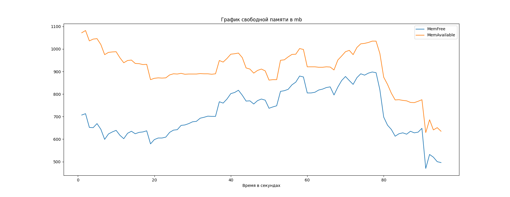
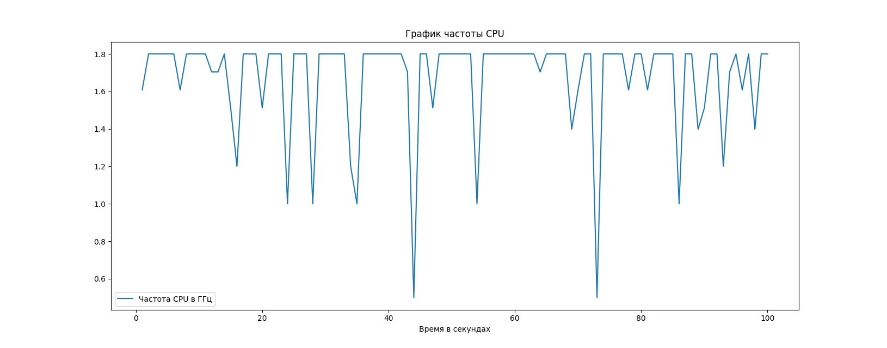
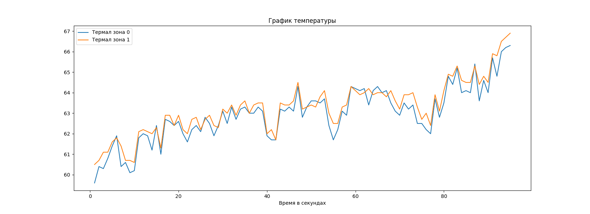
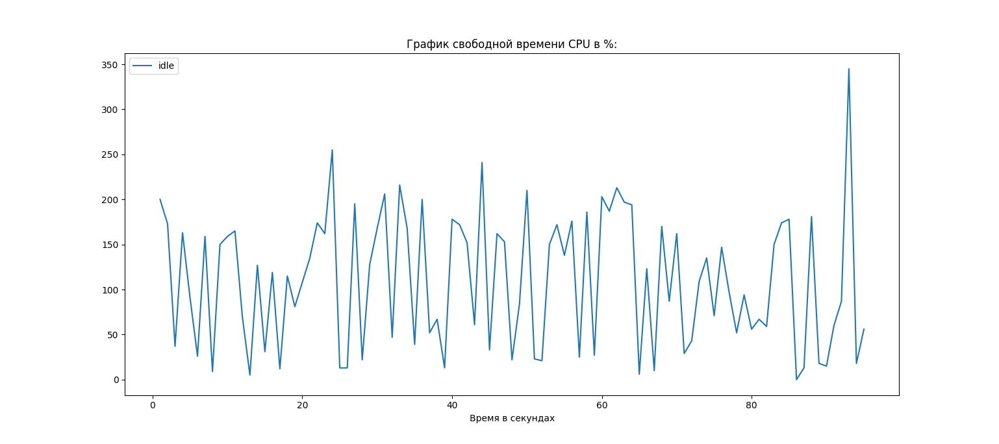

# Проект для мониторинга перформанcа на Android Devices 
**Проект написан не идеально и имеет баги, но будет дорабатываться по возможности**


### Ответственные лица:

* Starostin Aleksandr:
  * Telegram: [Alex Stark](https://t.me/Alex_Stark1)

  

### Тестируемый поверхности:
**Android devices на платформе Amlogic S905Y2, Android 11**


### Установка и запуск
```shell
 git clone 
 cd monitoring
 pip install -r requirements.txt
```

### Описание и запуск утилиты:
```shell
~/D/pythonProject ❯❯❯ ./monitoring.py -h                                                                                                                                                                              ✘ 128
usage: monitoring.py [-h] -tm  [-a] [-m] [-i] [-t] [-f] [-u] [-v]

Утилита для мониторинга перформанса девайса на платформе Android. Для запуска утилиты вам нужно указать время в секундах при помощи аргумента "-tm" или "--time" и выбрать конкретный агрумент для мониторинга
опреденного параметра (выбор нескольких аргументов пока не доступен), или указать параметр "-a" или "--all". После завершения вам будут выведены графики для анализа и min, avg, max значения в консоль. Пока не
адаптировано для Y4!

optional arguments:
  -h, --help     show this help message and exit
  -tm , --time   [ Время работы мониторинга в секундах ]
  -a, --all      [ Запустить мониторинг всех параметоров ]
  -m, --memory   [ Запуск мониторинга свободной памяти ]
  -i, --idle     [ Запуск мониторинга idle из утилиты top ]
  -t, --temp     [ Запуск мониторинга температуры ]
  -f, --freq     [ Запуск мотиторинга частоты CPU ]
  -u, --uptime   [ Запуск мотиторинга load averages ]
  -v, --version  show program's version number and exit
```

## Результаты запуска:
### Графики для анализа перформанса
##### После прохождения тестов, результаты можно посмотреть в построенных графиках.





##### Также вывод в консоль с  min, avg, max значений параметра
```shell
thermal_zone0 / thermal_zone0:
Мин.значение = 55.3 / 55.5
Сред.значение =  55.525 / 55.65
Макс.значение = 55.7 / 55.8

freq:
Мин.значение = 1.2
Сред.значение =  1.4055
Макс.значение = 1.512

MemFree / MemAvailable:
Мин.значение = 866 / 1061
Сред.значение =  870.25 / 1061.25
Макс.значение = 874 / 1062

idle:
Мин.значение = 229
Сред.значение =  282.0
Макс.значение = 319

LoadAverages_1 / LoadAverages_2 / LoadAverages_3:
Мин.значение = 3.62 / 3.42 / 3.34
Сред.значение =  3.7024999999999997 / 3.445 / 3.3525
Макс.значение = 3.86 / 3.49 / 3.37
```


